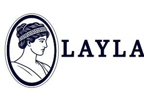

  

<h1 align="center">LAYLA</h1>

  <b>Low-cost Autonomously Yielded Leveling Alliance</b> 
  An open-source digital leveling and alignment initiative.

---

## 📌 About
**LAYLA** is an open-source project created to provide high-precision leveling and alignment solutions.

> 🚧 **Work in Progress:** This project is currently in its initial stage of development.

## 🎨 Brand Assets
All official logos and brand files are available in the [`assets/brand/`](./assets/brand/) directory.

## 📄 License
Distributed under the **MIT License**. See [`LICENSE`](LICENSE) for more information.
